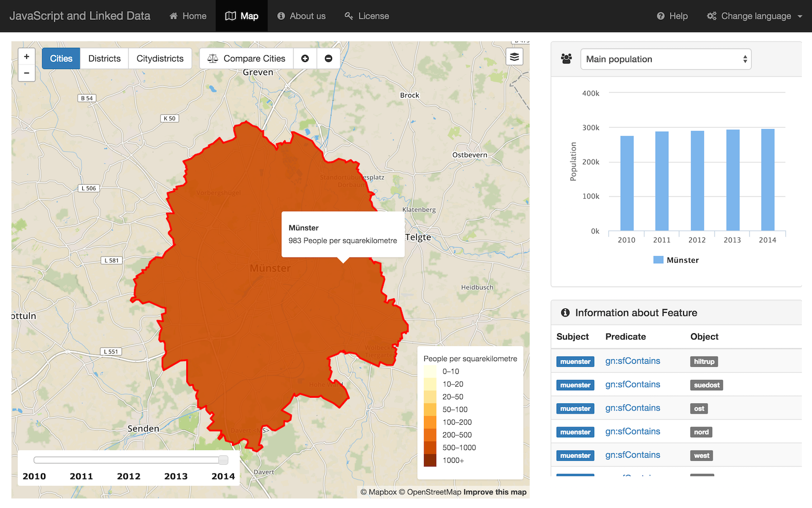

# An Introduction into JavaScript and Linked Data

This project is part of the course *An Introduction into JavaScript and Linked Data* at the Institute for Geoinformatics, Münster, which took place in winter term 2015/16. 

This web-application focuses on Linked Data about the population of Münster, Germany. The Open Data was provided by the *Amt für Stadtentwicklung, Stadtplanung, Verkehrsplanung* ([http://www.stadt-muenster.de/stadtentwicklung/zahlen-daten-fakten.html](http://www.stadt-muenster.de/stadtentwicklung/zahlen-daten-fakten.html)) and was converted into RDF-triples to demonstrate the Linked Data concept. The defined RDF-Schema can be also found in this repository (see: `/schema`). It contains

* the `rdf-baseGeometry_schema.txt` to provide the City, Distrcits and Citydistricts of Münster
* and the `rdf-population_schema.txt` to store the population-values.

The RDF-Schema is written in the RDF-Turtle-Syntax ([https://www.w3.org/TR/turtle/](https://www.w3.org/TR/turtle/)). The created RDF-Data is stored in a Parliament triple store ([http://parliament.semwebcentral.org](http://parliament.semwebcentral.org)). The application can filter and request the RDF-Data via AJAX and visualized it in different styles on an interactive map:

***

## Contributors

#####  [Du Guiying](https://github.com/robinhood747)
#####  [Thapa Pawan](https://github.com/pawan100)
#####  [Nicholas Schiestel](https://github.com/nicho90)
#####  [André Wieghardt](https://github.com/AndreWieghardt)

## Steps to build and run the application

1. Install **NodeJS**: [https://nodejs.org/en/](https://nodejs.org/en/)
2. Open a terminal and move with command `cd` to the directory of the project
3. Install the Node-Packages with command `sudo npm install`
4. Create a new folder in `/public/lib` (by command-line `mkdir /public/lib`)
5. Install **Bower** `sudo npm install -g bower`
6. Move with command `cd /public` to the directory `public`
7. Install Bower-Packages with command `bower install`
8. Move with command `cd ../` back to the directory of the project
9. Run NodeJS-Server with the command `node server.js`
10. Open a web-browser and go to `localhost:8080`
11. (You also need a **Parliament triple store** with the stored RDF-Data)

## minified version
To run the application as the minified version, just use the command `node server.js minified` to run the NodeJS-server

## License
 This Linked Open Data Application by Guiying Du, Nicholas Schiestel, Pawan Thapa, André Wieghardt is licensed under a <a rel="license" href="http://creativecommons.org/licenses/by-nc/4.0/">Creative Commons Attribution-NonCommercial 4.0 International License</a>.
